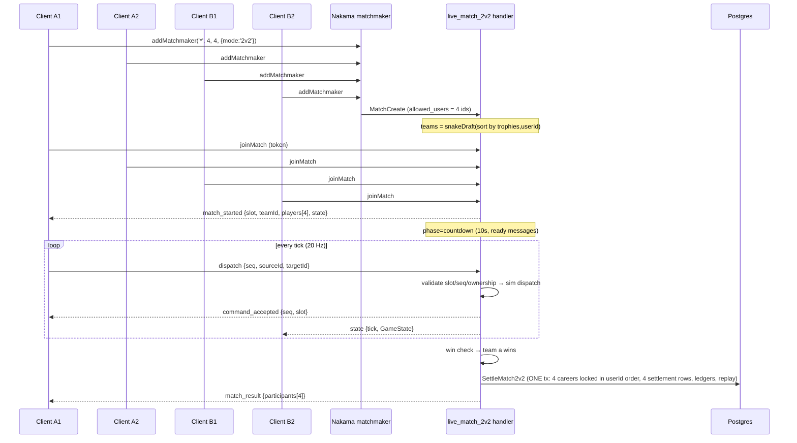
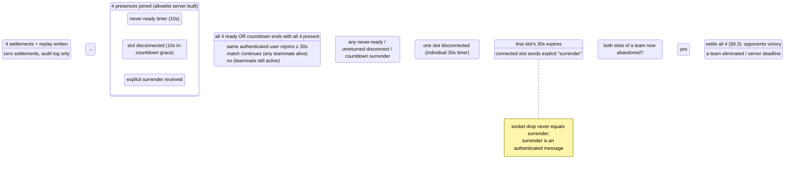

# 2v2 Multiplayer Architecture

Status: **design only — nothing here is implemented.** This document is the
implementation specification for authoritative 2v2 matches. It preserves bot
mode, authoritative 1v1 PvP, deterministic simulation, replay validation, and
settlement idempotency as invariants, not casualties.

Every claim about the current system in §1 was verified against source on
2026-09-22 (post royal-ring pack, commit `21b8cb0`). Nakama runtime API claims
were verified against the pinned dependency source
(`github.com/heroiclabs/nakama-common@v1.47.0`). Revised after design review:
matchmaker isolation (§3.2), unified matched-callback routing (§3.2.3),
map symmetry with machine proof (§7.3), atomic multi-participant settlement
(§9.3), trophy economy (§2.6), disconnect state machine (§5).

---

## Table of contents

1. [Current-system evidence](#1-current-system-evidence)
2. [Recommended 2v2 game model](#2-recommended-2v2-game-model)
3. [State and message schemas](#3-state-and-message-schemas)
4. [Sequence diagrams](#4-sequence-diagrams)
5. [Disconnect and recovery policy](#5-disconnect-and-recovery-policy)
6. [Determinism and cross-engine parity](#6-determinism-and-cross-engine-parity)
7. [Battlefield design](#7-battlefield-design)
8. [Client UX design](#8-client-ux-design)
9. [Migration and backward compatibility](#9-migration-and-backward-compatibility)
10. [Security and abuse analysis](#10-security-and-abuse-analysis)
11. [Testing strategy](#11-testing-strategy)
12. [Phased implementation plan](#12-phased-implementation-plan)
13. [Risks and unresolved decisions](#13-risks-and-unresolved-decisions)

---

## 1. Current-system evidence

### 1.1 Process map (as it exists today)

```
MenuScene ──bot──▶ careerManager.startBotMatch ─▶ RPC match/start ─▶ bot_matches row
   │                                                          ▲
   │──live──▶ LiveMatchClient.connect(mode)                   │ settlement RPC match/settle
   │            ├─ 'queue'  ─▶ socket.addMatchmaker('', 2, 2) │ (server re-simulates actions)
   │            ├─ 'create' ─▶ RPC pvp/create_invite          │
   │            └─ 'join'   ─▶ RPC pvp/join_invite            │
   │                └─ matchmakerMatched (Go) ─▶ MatchCreate("live_match")
   │                                  │ len(entries)!=2 → error
   ▼                                  ▼
GameScene (mode: 'bot'|'live') ◀── opcodes 2/3/5/6/7/8 ── live_match handler (Go, 20 Hz)
   │  bot: full local sim + recorded PvpAction[]
   │  live: army dead-reckoning + authoritative snapshot reconciliation
   ▼
match_result ─▶ processLiveMatchResult / recordMatchResultRemote ─▶ career, trophies, league, daily
```

### 1.2 Server (apps/server-nakama)

| Concern | Evidence |
| :--- | :--- |
| Match module | `main.go:81` `initializer.RegisterMatch("live_match", newLiveMatchHandler(store))` — the only real-time handler |
| Matchmaking completion | `main.go:281–297` `matchmakerMatched`: hard failure `matchmaker_expects_two_players` when `len(entries) != 2`; builds `allowed_users` from the 2 presences; `nk.MatchCreate(ctx, "live_match", …)`. **Nakama exposes exactly one matched callback per process** (`nakama-common@v1.47.0` `runtime/runtime.go:354–355`), so 2v2 must extend this one callback, not register a second (§3.2.3). Client ticket messages are interceptable server-side via `RegisterBeforeRt("MatchmakerAdd", …)` (`runtime/runtime.go:344`); the repo registers no `RegisterBeforeRt` hook today. |
| Invite PvP | `rpcCreateInvite` / `rpcJoinInvite` (`main.go:330–337`), 8-hex code, label `invite:<code>` (`live.go:346` `newLiveJoinCode`) |
| Match state | `live.go:34–46` `liveMatchState`: `players [liveMaxPlayers]*livePlayerState` with `liveMaxPlayers = 2` (`live.go:23`); `livePlayerState{presence, userID, displayName, career, role Team, nextSeq int}` |
| Tick loop | `live.go:203–260` at `liveTickRate = 20`; per tick: drain messages, `stepSimulation(state, accumulators, 1/20)`, broadcast role-projected state |
| Client payload | `live.go:29–35` `liveClientMessage{Type, Sequence, SourceID, TargetID}` — no tick index, no slot, no checksum |
| Validation | `presenceByID` → slot; strict `nextSeq == payload.Sequence`; `dispatchArmy` re-checks `source.Owner != owner → ErrPvpInvalidDispatch` (`domain.go:606`) |
| Role projection | `live.go:309–345` `stateForRole`/`mapTeamForRole`: slot 1 sees the same world with `player`/`enemy` swapped so *both* clients run identical core state |
| Rejections | opcode 6 codes: `invalid_payload, unknown_message, invalid_sequence, invalid_dispatch, live_match_not_started` |
| Disconnect | `live.go:177–200` `MatchLeave` mid-match = immediate forfeit; `canonicalForfeitStatus` (`live.go:195`) flips victory/defeat for the remaining player; settled at once |
| Battlefield pick | `live.go:88` uniform random from `battlefieldIDs` (`domain.go:423`); JSON embedded via `//go:embed battlefields.json` (`domain.go:29–30`) |
| Settlement | Pure `SettleMatch` (`domain.go:205–257`) + transactional `Store.SettleMatch` (`store.go:245–274`), idempotent via `match_settlements` PK + `ON CONFLICT (match_id) DO NOTHING` (`store.go:222`) with `getCareerForUpdate` row lock. **Ledger ids are `matchID + "_coins_\|_trophies_" + timestamp` (`domain.go:217, 229`) — match-scoped only, so four participants settled in the same millisecond would collide and be silently dropped by `ON CONFLICT (id) DO NOTHING` (`store.go:894–905`); 2v2 ledger ids must include the user id (§9.3).** |
| Bot settlement | `Store.SettleMatchVerified` (`store.go:299–355`): server re-simulates the recorded actions before paying out |
| Async PvP | `PvpAction{Sequence, AtSeconds, SourceID, TargetID}` (`types.go:110–116`), `pvp_attacks` table; single `attacker_id`/`defender_id` columns |
| Replay | **No stored replay.** "Replay" = re-simulating a recorded action list in-engine; parity harness scenarios live in `test/scripts/bot_parity_crosscheck.mjs` |
| Go sim | `domain.go` is a parallel TS-free reimplementation (`stepSimulation`, `dispatchArmy`, `resolveArrival`, `evaluateAIMove`); FMA drift handled by `productionAccumulatorEpsilon = 1e-9` and `aiScoreEpsilon = 1e-9`; territory order pinned by `territoryOrderForBattlefield` (`domain.go:76–83`) |

DB tables (migrations.go, each in a transaction + `schema_migrations` row):
`players`, `player_names`, `economy_ledger`, `match_settlements`,
`upgrade_purchases`, `pvp_defenses`, `pvp_attacks`, `analytics_events`,
`player_daily_progress`, `daily_reward_claims`, `league_reward_claims`,
`bot_matches`.

### 1.3 Shared simulation (packages/game-core/src)

| Concern | Evidence |
| :--- | :--- |
| Side identity | `types.ts:6` `export type Team = 'player' \| 'enemy' \| 'neutral';` — **the only side representation**; no player ids exist inside `GameState` (`types.ts:60–68`) |
| Stats | `types.ts:52–58` `MatchStats` has literal pair fields (`playerUnitsDispatched`, `enemyUnitsDispatched`, `territoriesCapturedByPlayer/ByEnemy`) |
| Result | `types.ts:50` `MatchStatus = 'playing' \| 'victory' \| 'defeat' \| 'draw'` — first-person, no winner id |
| Action | `pvp.ts:66–71` `PvpAction{sequence, atSeconds, sourceId, targetId}`; the only verb is "dispatch 50%"; `MAX_PVP_ACTIONS = 120` |
| Tick | `PVP_SIMULATION_TICK_SECONDS = 0.02` (`pvp.ts:23`); `consumeSimulationTicks` budgets ≤ 20 ticks/frame |
| Determinism | No RNG in the sim; army ids injected deterministically (`pvp_player_${sequence}`); float parity via `ACCUMULATOR_SNAP_EPSILON = 1e-9` (`generation.ts`) and `AI_SCORE_EPSILON = 1e-9` (`ai.ts`) |
| Combat | `combat.ts:resolveArrival` — same-owner arrival reinforces; hostile arrival: capture if `incoming > ceil(units × fortress?1.25:1)`, tie annihilates both |
| Modifiers | Applied **at init** per player (`map.ts:16–25` hard-codes `p_base`/`e_base`) and **per dispatch** (speed multiplier argument) |
| Win check | `simulation.ts:147–190` exactly two-sided elimination + two-total tiebreak |
| Battlefields | `battlefields.ts:1` imports `apps/server-nakama/battlefields.json` directly — single source, cannot drift; `validateBattlefieldDefinition` mandates exactly one `p_base` + one `e_base` and 180° rotational symmetry |
| Maps | crown_cross: 9 territories / 16 roads, central fortress hub; twin_passes: 8 / 9, two flank lanes + cross-link, no center; royal_ring: 10 / 12, closed ring, bases at SW/SE vs NW/NE |

### 1.4 Client (apps/game/src)

| Concern | Evidence |
| :--- | :--- |
| Lobby entry | `MenuScene.ts:862–927` `startClient(mode)` → on `match_started`, `scene.start('GameScene', { mode: 'live', liveClient, liveMatch })` |
| Session | `api/NakamaClient.ts:96–114` `login()`: custom-id auth `` `${platform}:${user.id}` ``, in-memory session, singleton via `api/sharedClient.ts` |
| Ticket | `api/LiveMatchClient.ts:178–199` `connect('queue')` → `socket.addMatchmaker('', 2, 2)` — **empty query, count hard-coded 2, no properties** |
| Opcodes | `LiveMatchClient.ts:71–77` — 1 dispatch, 2 match_started, 3 state, 5 accepted, 6 rejected, 7 result, 8 error |
| Envelope | `LiveMatchStarted{matchId, role: 'player'\|'enemy', playerName, opponentName, state}` (`LiveMatchClient.ts:21–67`) |
| Prediction | Live mode is **not** a full sim: `stepLiveMatch` (`GameScene.ts:1676–1682`) only dead-reckons armies (`stepLiveArmies`, cap `progress` 0.99); server owns all arrivals |
| Reconciliation | `reconcileLiveArmies(localArmies, serverArmies, blendWeight = 0.35)` (`LiveCombatFeedback.ts:130–135`) — matches predictions to server armies by `(sourceId, targetId)` **among `owner === 'player'` armies only**; `pred_` ids renamed on confirm; `command_rejected` → `rejectLivePrediction` |
| Stale snapshots | `GameScene.ts:3713–3795` `bindLiveMatch` drops `elapsedTimeSeconds <= last` |
| Disconnect | **No mid-match rejoin.** socket `closed` → `match_quit` + `live_match_disconnected`, force `status='defeat'`, `showLiveConnectionError` (`GameScene.ts:3776–3809`); server forfeits via `MatchLeave` |
| Rematch | Bot-only. Live "PLAY AGAIN" restarts a **bot** match (`GameScene.ts:3693–3704`) |
| Result idempotency | `settledMatchId` / `lastSettledMatchId` guards (`gameSceneGuards.ts:110–150`) |
| Team colors | `theme.ts:21–45` two-team palette; textures keyed by `owner` via `resolveTerritoryTextureKey` |

### 1.5 Parity and CI

| Concern | Evidence |
| :--- | :--- |
| Cross-engine | `test/scripts/bot_parity_crosscheck.mjs` (`npm run test:parity`): 3 engines (client prediction mirror, TS replay, Go). Go side: `parity_replay_test.go` `TestParityReplayDump` env-gated `PARITY_SCENARIOS`/`PARITY_OUTPUT`; checkpoint mirror `simulateBattleWithCheckpoints` must agree with the real engine (fails closed) |
| Checkpoints | `{kind: ai_tick\|player_action\|skipped_action\|final, at, status, elapsed, territories{id→{owner,units,productionRate}}, armies[…], accumulators}`; integers exact, floats rel-tol 1e-9 |
| Numerical audit | `numerical_audit.mjs` ↔ `numerical_audit_test.go`, bit-for-bit (`math.Float64bits`): arrival steps, production grant hashes (FNV-1a), AI decisions incl. FMA razor edges (`production_parity_test.go`, `ai_parity_test.go`) |
| Real stack | `test/smoke/live_pvp.smoke.mjs` + `test/smoke/bot_parity.smoke.mjs` against `docker compose` (postgres 16 + nakama; `live_test.go` itself is pure unit tests) |
| CI | `.github/workflows/ci.yml`: job 1 build/test/typecheck/go test/parity/audit; job 2 real-stack smoke. No browser E2E job |
| Gap | **Nothing anywhere is 4-player aware** — `liveMaxPlayers`, `Team`, `MatchStats`, matchmaker counts, checkpoint schema are all 2-player-shaped |

### 1.6 What must NOT change (invariants)

- `Team = 'player' | 'enemy' | 'neutral'` as the sim-internal ownership of
  territories and armies (all three engines agree on it today).
- 0.02 s fixed tick, no RNG, deterministic army-id injection, epsilon policy.
- `match_settlements` idempotency and economy-ledger append-only writes.
- 1v1 message opcodes and `live_match` handler behavior for existing clients.
- The three existing battlefields and their JSON single-source-of-truth.

---

## 2. Recommended 2v2 game model

### 2.1 Core decision: teams stay binary inside the simulation

The simulation already models exactly two armed sides. Four individual players
would force a rewrite of `Team`, `MatchStats`, win checks, AI, the Go engine,
and every parity checkpoint. Instead:

> **The sim keeps two sides.** Side `'player'` = Team A, side `'enemy'` =
> Team B. Player *slots* (0–3) are an envelope layer above the sim, carried in
> messages, match state, and settlement — never inside `GameState`.

This is the single highest-leverage simplification available: `GameState`,
`stepSimulation`, `resolveArrival`, AI, and every existing parity checkpoint
remain untouched for ownership purposes. Tradeoff: the sim cannot answer
"which *player* captured the territory" — the authoritative match handler
derives per-player attribution (§2.6) at the envelope layer.

### 2.2 Slots and identity

| Identifier | Shape | Lives in |
| :--- | :--- | :--- |
| `matchId` | Nakama match id | envelope |
| `slot` | `0..3` | envelope; stable for the whole match |
| `teamId` | `'a' \| 'b'` derived: `slot < 2 → 'a'`, else `'b'` | envelope + projected to sim `Team` |
| `userId` | Nakama user id | envelope; presence key |
| `startBase` | the one base territory the slot spawned at (modifier attribution) | envelope |

Team assignment is a pure function of the matchmaking result (§3.2), so both
the server and a reconnected client can recompute it.

### 2.3 Territory control model — shared team ownership (recommended)

**Either teammate may dispatch from any team-owned territory, and all
team-owned territories are shared.** Each teammate *starts* owning exactly one
base territory (one distinct starting base per player — see the topology,
§7.3); ownership semantics are team-wide from the first tick, so the base is
team property that the player merely spawned at. Init modifiers (§2.4) are
attributed through that starting base. Adjacent nodes are neutral at start.

Why this model:

- It matches existing combat semantics exactly: `resolveArrival` reinforces
  any same-owner target (`combat.ts`), and `dispatchArmy` already validates
  source ownership by `Team`. Teammate reinforcement **falls out for free**.
- No new "player-controlled subset" state, no per-player territory locks, no
  disputes over who owns a captured neutral.
- Disconnect behavior is natural: a departed teammate's territories stay in
  play for the survivor (§5).

Tradeoff: teammates can "steal" each other's armies from shared pools, which
enables griefing (§10 mitigations: no mitigation beyond social + reporting for
v1 — flagged as an unresolved product decision if team-shared pools prove
abusive; the alternative "assigned territories only, no shared dispatch" is a
one-line change at the validation point, `live2v2.go` slot permission check).

### 2.4 Modifiers and production

- **Init modifiers (garrison/production from upgrades):** per *player*, applied
  to that player's starting base (one owned base per player, §2.3). Two
  players on a team means two init-modifier applications per team —
  implemented at a new 2v2 init function in game-core, not inside `map.ts`
  (which stays 1v1-shaped).
- **Dispatch speed multiplier:** per *dispatching player*, passed per action.
  `dispatchArmy` already takes it as an argument — the server passes the
  dispatcher's multiplier instead of a role constant. Per-army or
  per-territory modifier storage is **not** introduced.
- **Commander:** per player, feeds the same two modifier channels.

### 2.5 Action ordering between teammates

Actions from four clients funnel through the single authoritative
`MatchLoop` goroutine (Nakama match loops are single-threaded per match), so
there is no concurrency to arbitrate — only a canonical order to define. Rule
in §6.2. The sim processes dispatches in that order; because a dispatch is
"take 50% of source", two near-simultaneous teammate dispatches from the same
source resolve deterministically by that order (first one takes its half).

### 2.6 Capture attribution, victory, surrender, rematch, rewards

| Rule | Decision |
| :--- | :--- |
| Capture attribution | Sim reports `CombatResult.newOwner` as a *Team*. Per-player stats (`MatchStats2v2`) attribute a capture to the slot that owned the dispatching army (`army.dispatchedBySlot`, an envelope-only annotation attached by the match handler; it never enters sim state). |
| Victory / defeat | Team-level: a team loses when it has zero territories **and** zero armies (existing two-sided check, unchanged). All members of the winning team get `victory`; losing team `defeat`; timeout tiebreak identical per team. |
| Surrender | **Explicit, distinct, authenticated message** (`{schemaVersion: 2, type: "surrender"}`) — never inferred from an ordinary socket drop (§5). One teammate surrendering marks *that slot* abandoned; the team fights on with shared territories. If both teammates surrender, the team forfeits and all four settle. |
| Rematch | Vote: after `match_result`, each client may send one `rematch_vote` message within 10 s. **All four** yes → server creates a new 2v2 match with identical teams and battlefield; anyone who declines/idles out drops to the menu. Live rematch does not exist today (§1.4), so this is additive. **Rematch is rated-neutral at launch** — see the trophy policy below. |
| Rewards (trophy economy) | **Do not assume settlement is zero-sum.** Current 1v1 rewards are victory **+30** / defeat **−12** trophies (`CalculateMatchRewards`, `domain.go:163–185`), so a settled 2v2 match would create a net **+36** trophies per split result under the ranked policy. The pure `SettleMatch` (`domain.go:186–257`) hard-codes that policy: it computes the trophy delta, writes it into the resulting career, appends a trophy ledger entry whenever the delta is non-zero, and returns ranks/promotion — so it **cannot** be "reused unchanged" for a zero-trophy casual mode. Design (NEW code): a `MatchRewardPolicy` and a generalized pure function `SettleMatchWithPolicy(career, status, stats, matchID, timestamp, policy)`; the existing `SettleMatch` becomes a one-line call with `RankedPolicy` and stays behaviorally identical. **2v2 casual policy (`CasualPolicy`)**: coin rewards calculated exactly as ranked (base/speed/domination/streak/treasury); **trophy delta exactly 0** (victory, defeat, and draw alike); previous and new trophy values identical; **no trophy ledger entry emitted**; ranked league progress **not advanced** (league tiers derive from trophies); daily missions **do** advance (`matches_played` counters are mode-agnostic v1 — flagged as a product tuning knob). Abandoned/surrendered slots: see §5.3. |
| Abandoned/surrendered players | **v1 rule (recommended): reduced consolation.** A slot that was abandoned or surrendered at settlement receives defeat-tier coins (10 base, no speed/domination/streak bonuses) with trophy delta 0, regardless of the team's outcome; connected teammates settle by team result. This removes the incentive to idle to a carried victory while still letting a disconnected-but-returned player keep normal rewards for matches they finished connected. |
| Settlement mechanics | New atomic multi-participant transaction (§9.3). The existing `Store.SettleMatch` is keyed by `match_id` alone and **cannot** be called four times for one match; its pure reward calculation (`SettleMatch`) is reused, the store method is not. |

### 2.7 Explicitly rejected alternatives

- **Four sim sides** (`Team` → 4 armed values): rewrites `Team`, win checks,
  AI scoring, `MatchStats`, all parity checkpoints, and the Go engine's
  ownership comparisons for zero gameplay benefit. Rejected.
- **Per-player territory ownership inside the sim**: adds an ownership layer
  combat doesn't need; makes shared defense impossible; complicates
  disconnect. Rejected for v1 (revisit if griefing data demands it).
- **AI teammate fill for quitter's slot**: attractive, but `evaluateAiMove`
  is written for the `'enemy'` side and its parity pins are 2-sided; filling
  mid-match with AI breaks replay determinism guarantees. Deferred (§13).

---

## 3. State and message schemas

### 3.1 Server match state (proposed `live2v2.go`, new module `live_match_2v2`)

A **separate handler module** so the 1v1 handler is untouched (rollback = stop
creating 2v2 matches). Shared helpers are imported, not forked, where safe.

```go
const (
    live2v2MaxPlayers = 4
    live2v2TickRate   = 20
    live2v2GraceCountdownSecs = 10 // §5
    live2v2GracePlayingSecs   = 30
    live2v2MaxMatchTime       = Pvp2v2TimeLimitSeconds + 30
)

type live2v2SlotState struct {
    presence      runtime.Presence // nil until (re)join; latest wins (§3.5)
    userID        string
    displayName   string
    career        PlayerCareer
    teamId        string    // "a" | "b"  (slot 0,1 → a; slot 2,3 → b)
    startBase     string    // the one base this slot spawned at (§2.3)
    nextSeq       int
    connected     bool
    disconnectedAtTick int64 // 0 = connected; individual grace timer (§5)
    abandoned     bool
    surrendered   bool      // explicit "surrender" message received (§5)
    ready         bool
}

type live2v2MatchState struct {
    store         *Store
    slots         [live2v2MaxPlayers]*live2v2SlotState
    presenceByID  map[string]int    // userID -> slot (latest session wins)
    state         GameState         // unchanged 1v1-shaped sim state
    accumulators  map[string]float64
    actionLog     []CanonicalAction // §6.2 — the replay
    tick          int64
    startedAt     int64
    phase         string // "countdown" | "playing" | "finished"
    allowedUsers  []string
    battlefieldID string
    mode          string // "2v2"
    schemaVersion int    // 2
}
```

### 3.2 Matchmaking, ticket validation, and team assignment

**Nakama API facts (verified against `github.com/heroiclabs/nakama-common@v1.47.0`,
the version pinned in `apps/server-nakama/go.mod`):**

- `Initializer.RegisterMatchmakerMatched` exists as **exactly one** callback per
  server process (`runtime/runtime.go:354–355`: `RegisterMatchmakerMatched(fn
  func(ctx, logger, db, nk, entries []MatchmakerEntry) (string, error)) error`).
  The repo already registers it once (`main.go:78`) — a second registration for
  2v2 is impossible and is not proposed.
- Client ticket messages are `rtapi.MatchmakerAdd{MinCount, MaxCount, Query,
  StringProperties, NumericProperties, CountMultiple}`
  (`rtapi/realtime.pb.go:2282–2298`).
- `MatchmakerEntry.GetProperties() map[string]interface{}`
  (`runtime/runtime.go:935–941`) exposes ticket properties to the matched
  callback.
- **A wildcard query filters on nothing**: a `'*'` query does not compare
  against other tickets' properties. Filtering requires an explicit query over
  `properties.*` fields, e.g. `+properties.mode:2v2`.

#### 3.2.1 Ticket contents (client and server)

```ts
// LiveMatchClient.ts — new code path (existing 'queue' untouched on the client)
this.socket.addMatchmaker('*', 4, 4, {
  mode: '2v2',      // string property
  schema: '2',      // string property
}, {
  rating: career.trophies,  // numeric property — ADVISORY ONLY, see below
});
```

Server-side matchmaker query (overwritten by the hook below, never trusted
from the client):

```
+properties.mode:2v2 +properties.schema:2
```

#### 3.2.2 Server-side ticket validation — `RegisterBeforeRt`

`Initializer.RegisterBeforeRt(id, fn(ctx, logger, db, nk, in *rtapi.Envelope)
(*rtapi.Envelope, error))` (`runtime/runtime.go:344`) intercepts realtime
client messages **by message name before processing** — `"MatchmakerAdd"` is
one of the hookable message names. **Do not trust any client-supplied property
or query**: the hook overwrites them with server state.

```go
// NEW: before_matchmaker_add.go
// RegisterBeforeRt("MatchmakerAdd", beforeMatchmakerAdd(store))
func beforeMatchmakerAdd(store *Store) runtime.BeforeRtFunction {
    return func(ctx, logger, db, nk, in *rtapi.Envelope) (*rtapi.Envelope, error) {
        add := in.GetMatchmakerAdd()
        if add == nil { return in, nil }
        // Authoritative identity + rating from the authenticated server state.
        userID := ctx.Value(runtime.RUNTIME_CTX_USER_ID).(string) // authenticated session user
        trophies := store.GetTrophies(ctx, db, userID)           // server-side read, never client value
        switch classifyTicket(add) {
        case ticket2v2: // client min/max == 4 (or rewrite it): force 2v2 shape
            add.MinCount, add.MaxCount = 4, 4
            add.Query = "+properties.mode:2v2 +properties.schema:2"
            add.StringProperties = map[string]string{"mode": "2v2", "schema": "2"}
            add.NumericProperties = map[string]float64{"rating": float64(trophies)}
        case ticket1v1: // existing 1v1 tickets get pinned properties too
            add.Query = "+properties.mode:1v1"
            add.StringProperties = map[string]string{"mode": "1v1", "schema": "1"}
            add.NumericProperties = map[string]float64{"rating": float64(trophies)}
        }
        return in, nil
    }
}
```

**How 1v1 tickets stay isolated:** the existing client sends
`addMatchmaker('', 2, 2)` with no properties (§1.4). Before this feature it
matched any other ticket. With the hook, the server pins `mode: '1v1'` onto
those tickets and rewrites their query to `+properties.mode:1v1`, so a 1v1
ticket can only be satisfied by another `mode:1v1` ticket, and a 2v2 ticket
only by `mode:2v2`. This is a server-side change invisible to existing
clients (no client update required), and it closes both cross-matching
directions — including the dangerous one where an *empty* 1v1 query would
happily consume 2v2 tickets. The repo registers no `RegisterBeforeRt` hook
today (verified: no matches in `apps/server-nakama/*.go`), so this hook is new.

#### 3.2.3 One matched callback with mode routing

The single existing `matchmakerMatched` callback (`main.go:281–297`) becomes a
**router**. It no longer hard-fails on `len(entries) != 2`; it validates the
matched set and routes:

```go
// main.go — rewritten body of the ONE registered callback.
func matchmakerMatched(nk runtime.NakamaModule) runtime.MatchmakerMatchedFunction {
    return func(ctx context.Context, logger runtime.Logger, db *sql.DB, nk runtime.NakamaModule, entries []runtime.MatchmakerEntry) (string, error) {
        mode, ok := homogeneousMode(entries) // every entry must carry identical
                                             // string properties mode+schema; nil/missing/mixed → reject
        if !ok { return "", errors.New("matchmaker_mixed_or_missing_properties") }
        switch mode {
        case "1v1":
            if len(entries) != 2 { return "", errors.New("matchmaker_expects_two_players") }
            allowedUsers := allowlistFrom(entries) // built server-side from entry presences
            return nk.MatchCreate(ctx, "live_match", map[string]interface{}{
                "invited": false, "allowed_users": allowedUsers})
        case "2v2":
            if len(entries) != 4 { return "", errors.New("matchmaker_expects_four_players") }
            allowedUsers := allowlistFrom(entries)
            return nk.MatchCreate(ctx, "live_match_2v2", map[string]interface{}{
                "allowed_users": allowedUsers, "mode": "2v2"})
        default:
            return "", fmt.Errorf("matchmaker_unknown_mode: %s", mode)
        }
    }
}
```

Rejection rules (fail-closed): mixed `mode`/`schema` across entries, missing
properties, unknown mode, wrong entry count → the callback returns an error
**and creates no match of any mode**. The API contract does **not** guarantee
that an erroring callback dissolves the group or returns tickets to the pool,
so the design does not rely on that:

- the handler logs a **structured server error** (`mode` observed, entry
  count, property-presence flags — never property values or user ids) for
  operations diagnosis;
- clients get no `matchmaker_matched` event; their existing bounded queue
  timeout (15 s `LIVE_CONNECT_TIMEOUT_MS` → `live_connection_timeout`) fires,
  which is the recovery trigger;
- the client then **explicitly submits a fresh ticket** with bounded
  retry/backoff (max 3 attempts, 5 s/10 s/20 s), and never silently falls
  back into a different mode — a failed 2v2 queue returns the player to the
  2v2 lobby with the standard error mapping (`LivePvpController.mapLivePvpError`);
- an integration test proves recovery after a deliberately malformed group
  (§11, smoke row).

#### 3.2.4 Team assignment

Team assignment is a pure function of the four matched entries so any observer
recomputes it:

1. Sort entries by **server-read trophy value** (numeric property `rating`
   written by the before-hook from the `players` row — never the client's
   reported value), tie-broken by `userId` ascending, so the result is stable
   regardless of callback order.
2. Snake draft: `sorted[0]→teamA, sorted[1]→teamB, sorted[2]→teamB,
   sorted[3]→teamA` — top-rated players oppose each other.

- Match label: `mode:2v2;phase:open;v:2` → `mode:2v2;phase:in_progress;v:2`
  (label stays ≤ 64 bytes, searchable).

### 3.3 Message schemas (versioned)

Every payload carries `schemaVersion`. Opcodes are reused with the same
numbers; the version field is what old/new clients check.

**Client → server (opcode 1):**

```jsonc
// v2 — slot replaces role; everything else as 1v1
{ "schemaVersion": 2, "type": "dispatch", "sequence": 17,
  "sourceId": "n_mid_left", "targetId": "n_center" }
// new control messages
{ "schemaVersion": 2, "type": "ready" }
{ "schemaVersion": 2, "type": "rematch_vote" }
{ "schemaVersion": 2, "type": "surrender" }   // explicit; distinct from socket drop (§5)
```

**Server → client:**

```jsonc
// opcode 2 — match_started (v2)
{ "schemaVersion": 2, "type": "match_started", "matchId": "…", "mode": "2v2",
  "slot": 2, "teamId": "b",
  "players": [                       // all four, always
    { "slot": 0, "teamId": "a", "userId": "…", "displayName": "…" } ],
  "state": { /* GameState — same shape as 1v1 */ } }

// opcode 3 — state, every tick (identical to 1v1 shape)
{ "schemaVersion": 2, "type": "state", "tick": 1841, "state": { … } }

// opcode 5/6 — per-slot acks
{ "schemaVersion": 2, "type": "command_accepted", "sequence": 17, "slot": 2 }
{ "schemaVersion": 2, "type": "command_rejected", "sequence": 17, "slot": 2,
  "code": "invalid_dispatch" }   // new code: "slot_not_permitted"

// opcode 7 — match_result (v2): per-participant settlements
{ "schemaVersion": 2, "type": "match_result",
  "result": {
    "matchId": "…", "mode": "2v2", "winnerTeamId": "a",
    "participants": [
      { "slot": 0, "teamId": "a", "userId": "…", "status": "victory",
        "stats": { … }, "settlement": { … } }   // full MatchSettlement each
    ] } }
```

`MatchStats2v2` (envelope-level, computed by the handler):

```go
type MatchStats2v2 struct {
    UnitsDispatchedBySlot     [4]int64
    TerritoriesCapturedBySlot [4]int64
    TeamUnitsDispatched       [2]int64 // equals sim MatchStats per side
    TeamTerritoriesCaptured   [2]int64
}
```

### 3.4 Replay record (new)

**Authoritative replay store: one PostgreSQL row.** A new `match_replays`
SQL table (match_id PK, mode, battlefield_id, created_at, payload JSONB),
written inside `Store.SettleMatch2v2`'s transaction (§9.3) so the replay and
the four settlements commit atomically or not at all. No Nakama storage
collection is written in v1 — a Nakama storage write cannot participate in
the SQL transaction and would create a second source of truth. If support/
debug access to replays is needed later, it is served through an
authenticated server RPC reading the SQL row; any future mirror into Nakama
storage would be asynchronous, non-authoritative, optional, and outside
settlement correctness.

```jsonc
{
  "schemaVersion": 2,
  "mode": "2v2",
  "battlefieldId": "quad_citadel",
  "timeLimitSeconds": 90,
  "rewardPolicy": "casual",
  "players": [ { "slot": 0, "teamId": "a", "userId": "…",
                 "modifiers": { … PlayerUpgradeModifiers } } ],
  "actions": [                       // canonical order, §6.2
    { "tick": 812, "serverSeq": 40, "slot": 2, "clientSeq": 17,
      "sourceId": "n_mid_left", "targetId": "n_center" } ],
  "result": { "winnerTeamId": "a", "perTeam": [ { … } ] }
}
```

For 1v1 this same format with `mode: "1v1"` and slots `{0,1}` is the first
stored 1v1 replay — the async-attack action list keeps its existing shape.

### 3.5 Presence, handshake, tick ownership, deadline

- **Presence**: `MatchJoinAttempt` admits a user id exactly once; a second
  session for the same account evicts the older presence (`presenceByID` is
  authoritative). Presence events are observed in `MatchLoop` — no separate
  coroutine.
- **Ready/start handshake**: after the 4th join, phase `countdown` (10 s).
  Clients send `ready`. If all four ready early → start early. If any slot is
  unready or empty at countdown end → match cancels (`match_result` with
  `cancelled` outcome, no settlements) and the matchmaker re-queues survivors
  client-side. No backfill in v1 (§13).
- **Tick ownership**: the server is the sole simulator, exactly as today
  (`live.go` model). Clients dead-reckon armies only.
- **Server clock**: `elapsedTimeSeconds` in authoritative state is the match
  clock; clients never compute it. Deadline enforcement stays server-side
  (`live2v2MaxMatchTime`), with the timeout tiebreak from the sim.

### 3.6 Permission validation (who may act)

```go
// Pseudocode — MatchLoop, per message:
slot, ok := s.presenceByID[msg.UserID]        // sender's presence
if !ok                       → reject "not_in_match"
if msg.slot != slot          → reject "slot_not_permitted"   // §9 anti-spoof
if !s.slots[slot].connected  → reject "slot_disconnected"
if s.phase != "playing"      → reject "live_match_not_started"
if msg.sequence != s.slots[slot].nextSeq → reject "invalid_sequence"  // per-slot seq
// Team permission: source must be team-owned (sim check, existing):
if state.territories[msg.sourceId].owner != teamOf(slot) → reject "invalid_dispatch"
```

---

## 4. Sequence diagrams

### 4.1 Matchmaking → match → settlement (happy path)



### 4.2 Mid-match disconnect and reconnect

```mermaid
sequenceDiagram
    participant A2 as A2 (slot 1)
    participant MH as live_match_2v2 handler
    participant T as Teammate A1

    A2->>MH: socket drops (MatchLeave observed as presence event)
    Note over MH: slot 1: connected=false, individual 30s grace timer starts
    Note over MH: match continues; slot 1 territories stay team-owned
    MH-->>T: state (unchanged cadence; slot 1 badge shows signal-lost)
    alt reconnect ≤ 30s (same authenticated user)
        A2->>MH: joinMatch (fresh session)
        Note over MH: same slot restored; nextSeq preserved; older presence evicted
        MH-->>A2: match_started (resync) then state stream
        A2->>MH: dispatch {seq=nextSeq}  (client resets counter)
    else grace expires
        Note over MH: slot 1 abandoned=true (no AI takeover)
        Note over MH: team a continues with shared territories
        alt both team-a slots abandoned or surrendered
            MH->>MH: team b wins → settle all 4 (§9.3)
        end
    end
```

## 5. Disconnect and recovery policy

The disconnect state machine and grace periods below are normative for the
2v2 match handler (§3.1) and the client reconnect flow (§5.1).

### 5.0 Disconnect state machine

Rules (normative):

- **Each disconnected slot has its own individual 30 s grace deadline.** The
  match never pauses and never waits on a slot mid-game.
- **One disconnected player:** their slot enters grace; the teammate keeps
  playing (shared territories §2.3).
- **Both teammates disconnected:** each retains their own grace deadline; the
  match keeps running. If either reconnects before their deadline, play
  continues normally for the team.
- **Team forfeit** happens only when **both slots of a team have actually
  expired** (grace elapsed without reconnect) **or explicitly surrendered**.
  A mere simultaneous drop does not forfeit while any grace is running.
- **Explicit surrender** is a distinct authenticated message (`type:
  "surrender"`, §3.3) from a connected slot. An ordinary socket disconnect is
  never treated as surrender and never forfeits by itself.
- **Reconnect** restores the same slot **only for the same authenticated
  userId** (Nakama session identity). A different user can never claim a slot.
- **Countdown cancellation** distinguishes three cases: **never-ready** (slot
  joined but never sent `ready` by deadline), **disconnected** (slot lost
  presence during countdown — gets a 10 s in-countdown grace to return), and
  **explicit cancellation** (a connected slot sends `surrender` during
  countdown). All three end the match as `cancelled` with no settlements; the
  distinction is recorded in the match audit log for matchmaking-quality
  analytics. A slot empty at creation (backfill absent, §13) is also
  `cancelled`.



Grace periods (normative): countdown 10 s; in-game reconnect grace 30 s;
rematch vote window 10 s; matchmaking queue client timeout 15 s (unchanged
from `LIVE_CONNECT_TIMEOUT_MS`).

Abuse prevention rationale: the reconnect grace is short enough that a
disconnect cannot be used to freeze a losing position (the match keeps
running), and long enough to cover mobile WebView backgrounding (the existing
`PerformanceMonitor` already measures backgrounding durations — instrument
against this 30 s budget). In casual 2v2 an intentional disconnect causes a
defeat-tier result for that slot (§2.6, §5.3) but **no trophy change** — the
deterrent is the reduced coin consolation and the abandoned-slot rule, not
rating loss. Duplicate-session eviction closes the "second session watches
for free / hedges actions" hole.

### 5.1 Client submitting a stale action after reconnect

Reconnect handshake resyncs: server sends `match_started` (with current full
state and the slot's next expected sequence) before any state ticks. The
client resets `nextSequence = serverValue`. A stale action (pre-disconnect
sequence) fails the per-slot `invalid_sequence` check and is rejected
without side effects; the client drops its pending predictions on any
`command_rejected` (existing `rejectLivePrediction` path). Because actions
are slot-scoped, a stale action can never interleave with the teammate's
sequence stream.

### 5.2 Server restart / match-process failure

Nakama authoritative matches are in-memory; a node restart loses the match.
Policy: graceful `MatchTerminate` settles the match as `cancelled` — no
rewards, no ledger writes (matching the existing "no rewards for unfinished
matches" principle). Crash without `MatchTerminate`: the match dies; clients
hit the socket-closed path (§1.4), no settlement is written, and the
idempotency keys guarantee a partial-write race cannot duplicate rewards.

### 5.3 Rewards for abandoned or surrendered players (v1 rule)

A slot that is abandoned (grace expired) or explicitly surrendered at
settlement time receives **reduced consolation**: defeat-tier coins (10 base,
no speed/domination/streak bonuses), trophy delta 0 (casual policy, §2.6),
regardless of the team's outcome. Connected teammates settle by team result.
Rationale: removes the incentive to idle into a carried victory, keeps
disconnects non-punishing beyond coins in an unrated mode, and requires no
new reward machinery — only a status override per participant before the
`SettleMatchWithPolicy` call (§9.3 step 4).

---

## 6. Determinism and cross-engine parity

### 6.1 Audit: does the current simulation assume exactly two participants?

**The sim's ownership model is two-sided but identity-free, which is why the
§2.1 strategy works.** Precisely:

| Location | Assumption | 2v2 impact |
| :--- | :--- | :--- |
| `types.ts:6` `Team` | two armed sides | kept (teams are the sides) — no change |
| `types.ts:52–58` `MatchStats` | pair fields | kept for team stats; per-player stats move to envelope `MatchStats2v2` |
| `simulation.ts:147–190` win check | two-sided elimination | unchanged (per team) |
| `simulation.ts:152–158` capture stats | `'player'`/`'enemy'` branches | unchanged at team level |
| `map.ts:16–25` init modifiers | hard-coded `p_base`/`e_base` | **must change** (2 init applications per team at 2v2 init) |
| `pvp.ts` `simulatePvpBattle` | human='player', AI='enemy' | unchanged (bot/1v1); 2v2 replay uses a new entry point |
| `ai.ts` scoring | `'enemy'` side | unchanged (no AI in 2v2 v1) |
| `battlefields.ts` validator | one `p_base` + one `e_base` | **must change** (mode-aware validator, §9.2) |
| `progression.ts` `settleMatch` | single-career ranked policy | unchanged for 1v1; 2v2 calls the NEW `SettleMatchWithPolicy` wrapper with `CasualPolicy` (§2.6, §9.3) — client-side mirrored in Phase 7 |
| Go `live.go` | `[2]*livePlayerState`, `len(entries)!=2` | unchanged; new `live2v2.go` alongside |
| Go `domain.go` sim | two-sided | unchanged |
| Parity checkpoints | two-team owners | unchanged (teams still map to `player`/`enemy`) |

### 6.2 Canonical action ordering (normative)

**The server receive sequence is globally unique and is already the complete
order.** The `MatchLoop` drains `messages []MatchData` inside one invocation of
a single-threaded per-match goroutine; the handler assigns each drained message
the next value of one global monotonic counter (`serverSeq`). Two actions can
never share a `serverSeq`, so **within a tick, `serverSeq` alone fully orders
accepted actions**. Slot and client sequence are audit fields and consistency
checks, not tie-breakers — after `(tick, serverSeq)` the order is total and
nothing further is needed.

Canonical order (primary key first):

1. **Simulation tick** the action was accepted in (server tick counter),
2. **`serverSeq`** — the globally unique, monotonically increasing server
   receive sequence.

The replay log additionally records `slot` and `clientSeq` per action for
attribution and client-consistency auditing:

```jsonc
{ "tick": 812, "serverSeq": 40, "slot": 2, "clientSeq": 17,
  "sourceId": "n_mid_left", "targetId": "n_center" }
```

**When the tick is assigned:** the tick recorded for an action is the tick
whose `MatchLoop` invocation drained the message — assigned at drain time,
**before** dispatch validation. An accepted action is applied to the state at
the start of that tick's simulation step and enters the replay in drain order.
Rejected actions never enter the replay (§6.2.1).

**Replay = initial state + the accepted-action log**, so replay validity does
not depend on wall-clock arrival times (unlike today's async `AtSeconds`).

#### 6.2.1 Rejected actions

Rejected messages are **not** stored in the replay. They go to a separate,
non-authoritative audit log — a `match_audit` storage entry (one per match,
appended by the handler, bounded) recording `{serverSeq, tick, slot, code,
payloadHash}`. The replay must remain sufficient to reconstruct state from
accepted actions alone; the audit log exists for support/diagnostics and abuse
investigation and is safe to prune.

#### 6.2.2 Duplicate/subsequent ticks

Actions drained in the same `MatchLoop` call all share the tick and are
disambiguated by `serverSeq` alone. Actions drained in later ticks get later
ticks. There is no ordering decision that requires comparing slots or client
sequences.

### 6.3 Can both engines reproduce it exactly?

Yes. The Go handler and the TS parity harness both consume the same canonical
log; the sim core has no wall-clock input (`atSeconds` is replaced by tick
indices in 2v2 replays). Float parity machinery already exists and is
untouched: 0.02 s ticks, `ACCUMULATOR_SNAP_EPSILON` /
`productionAccumulatorEpsilon` (1e-9), `AI_SCORE_EPSILON`, pinned territory
iteration order (`territoryOrderForBattlefield`). The new surfaces are all
integer/discrete (slot attribution, ordering) — no new float operations, so
no new epsilon risk is introduced by ordering itself.

### 6.4 Numerical / architecture risks

| Risk | Mitigation |
| :--- | :--- |
| Dispatch speed multiplier now varies per *action* (dispatcher's), not per side | `dispatchArmy` already takes the multiplier per call; add parity scenarios where two slots on one team have different speed careers (§11) |
| Two init-modifier applications per team change starting unit math | New 2v2 init function; golden-value tests; keep 1v1 init untouched |
| `MatchStats` split (team vs per-slot) drifting between engines | Envelope-only in Go handler; TS mirror computed in the harness from the same action log |
| Replay size growth (4 players) | Dispatch-verb actions only; est. < 2× 1v1; cap `MAX_PVP_ACTIONS_2V2 = 240` |
| Single MatchLoop goroutine CPU at 20 Hz × 4 clients' messages | Same per-tick sim work as 1v1 plus message drain; load test (§11) |

---

## 7. Battlefield design

### 7.1 Assessment of existing maps for 2v2

| Map | Verdict | Reason |
| :--- | :--- | :--- |
| crown_cross | Poor | One base per team; a 2nd teammate has no spawn; the single central hub funnels everything through `n_center` — two attackers per lane trivially snowball the fortress. |
| twin_passes | Poor | Two lanes look teammate-shaped, but bases are single and the west/east passes are only cross-connected mid-map; a teammate pairing on one lane leaves the other 4-vs-1. |
| royal_ring | Poor | Closed ring with 2 base entry points; ring flow assumes one army per side; bases at SW/SE (player) would need to split between teammates with no symmetric neutral support. |

The validator also *mandates* exactly one `p_base`/`e_base` and two-side
symmetry — all three maps are structurally 1v1.

**Recommendation: add a dedicated first 2v2 battlefield.** Adapting a 1v1 map
would require per-mode validator branches anyway, and the shared-territory
model wants two spawn clusters per team from the start.

### 7.2 Requirements for the first 2v2 map

- Two tier-3 bases per team (one per teammate), 90–140 px apart, so teammates
  spawn adjacent but each owns a distinct init-modifier target.
- 180° point symmetry preserved (existing invariant class, mode-aware
  validator): every territory/road mirrors through (200, 360).
- 12–14 territories total (mobile readability ceiling; royal_ring's 10 is the
  current max) with ≤ 4 roads per node.
- Teammate lanes connected by one trunk road per team plus a contested central
  objective: anti-snowball via the center pulling forces mid.
- Tier/type mix mirrors existing balance: bases tier-3 fortress (20/65 @ 1.2),
  tier-2 center, tier-1 neutrals 8–10 units / 40 max / 0.85–0.9 production.
- Road connectivity: every team's center route is base → gate → center
  (≤ 2 hops); the farthest territory from a given team's bases is ≤ 4 hops
  (cross-team corner), which is desirable anti-snowball distance.
- Expected match duration: within the existing 90 s limit (§13 open question
  on extending it).
- Performance: ≤ 14 territories, ≤ 20 roads, same 400×720 canvas — no render
  or sim cost deltas beyond the extra armies 4 dispatchers create.

### 7.3 Proposed topology: `quad_citadel` (13 territories, 20 roads — symmetry machine-verified)

Coordinates in the existing 400×720 space. `a_*` = Team A spawns (bottom,
y > 360), `b_*` = Team B spawns (top), `n_*` neutral. Point symmetry through
(200, 360): every territory's mirror is `(400−x, 720−y)` with identical
radius, tier, type, units, maxUnits, and production rate. The only
self-mirrored territory is `n_center`.

| ID | Name | x | y | r | tier | type | units/max/prod | Mirror |
| :--- | :--- | ---: | ---: | ---: | ---: | :--- | :--- | :--- |
| `a_base_w` | West Bastion (A1 spawn) | 90 | 590 | 36 | 3 | fortress | 20/65/1.2 | `b_base_e` |
| `a_base_e` | East Bastion (A2 spawn) | 310 | 590 | 36 | 3 | fortress | 20/65/1.2 | `b_base_w` |
| `b_base_w` | North Citadel West (B2 spawn) | 90 | 130 | 36 | 3 | fortress | 20/65/1.2 | `a_base_e` |
| `b_base_e` | North Citadel East (B1 spawn) | 310 | 130 | 36 | 3 | fortress | 20/65/1.2 | `a_base_w` |
| `a_gate_w` | South Gate West | 115 | 470 | 27 | 1 | barracks | 8/40/0.9 | `b_gate_w` |
| `a_gate_e` | South Gate East | 285 | 470 | 27 | 1 | stable | 8/40/0.9 | `b_gate_e` |
| `b_gate_w` | North Gate East | 285 | 250 | 27 | 1 | barracks | 8/40/0.9 | `a_gate_w` |
| `b_gate_e` | North Gate West | 115 | 250 | 27 | 1 | stable | 8/40/0.9 | `a_gate_e` |
| `n_corner_sw` | Southwest Spur | 60 | 540 | 26 | 1 | stable | 8/40/0.9 | `n_corner_ne` |
| `n_corner_se` | Southeast Spur | 340 | 540 | 26 | 1 | barracks | 8/40/0.9 | `n_corner_nw` |
| `n_corner_nw` | Northwest Spur | 60 | 180 | 26 | 1 | barracks | 8/40/0.9 | `n_corner_se` |
| `n_corner_ne` | Northeast Spur | 340 | 180 | 26 | 1 | stable | 8/40/0.9 | `n_corner_sw` |
| `n_center` | Quad Keep | 200 | 360 | 34 | 2 | fortress | 16/55/1.15 | itself |

Roads — the full closed set, all 20 edges listed explicitly (mirrors are
mechanically derivable, but the shipped JSON must contain every edge because
the symmetry test compares sets, not generators):

```
# A-side (bottom) seed roads
a_base_w  — a_base_e       # teammate trunk
a_base_w  — a_gate_w
a_base_e  — a_gate_e
a_gate_w  — n_center
a_gate_e  — n_center
a_base_w  — n_corner_sw
a_base_e  — n_corner_se
n_corner_sw — a_gate_w
n_corner_se — a_gate_e
n_corner_sw — n_corner_se  # bottom corridor
# B-side mirrors (exact point-mirrors of the ten roads above)
b_base_w  — b_base_e
b_base_e  — b_gate_w
b_base_w  — b_gate_e
b_gate_w  — n_center
b_gate_e  — n_center
b_base_e  — n_corner_ne
b_base_w  — n_corner_nw
n_corner_ne — b_gate_w
n_corner_nw — b_gate_e
n_corner_ne — n_corner_nw  # top corridor
```

**Symmetry proof (read-only script, run 2026-09-22; reproduce with
`python3 /tmp/verify_quad_citadel.py` — to be checked into `tools/` as
`tools/verify_battlefield_symmetry.py` in Phase 6):** the script loads this
exact table and verifies, with `PROOF: PASS`:

- every non-center territory has exactly one mirror at `(400−x, 720−y)`; the
  mirror map is an involution; exactly one self-mirror (`n_center`);
- mirror attribute tuples `(r, tier, type, units, maxUnits, productionRate)`
  are equal for every mirror pair;
- the road set is closed under mirroring (each of the 20 edges' mirror edge is
  present; no edge maps to itself or duplicates another; the earlier
  draft of this section failed exactly this check with only 10 seed roads —
  the closed 20-edge set above is the fix);
- degrees: `n_center` 4, every other territory 3 (≤ 4 cap respected);
- totals: **13 territories, 20 roads**;
- 4 distinct starting bases, one per player (§2.3);
- connectivity: all territories reachable from every base; `n_center` exactly
  2 hops from each base (via its gate); max shortest path from a base to any
  territory = 4 hops (far cross-team corner); minimum pairwise territory
  spacing 58.3 px.

Anti-snowball: `n_center` (16/55/1.15) plus four corner spurs give a losing
team two recapture routes per flank; the teammate trunk road allows mutual
reinforcement but is also an enemy penetration lane once a base falls.

Readability: 13 territories at ≤ 4 roads each keeps lane structure legible at
360×800; territory count sits three above royal_ring, so per-frame entity
cost stays within current budgets (the Phase 8 load test must confirm this —
future acceptance work, not yet run). Minimum spacing
58.3 px is tighter than royal_ring's minimum — acceptable for radius-26
sprites (socket diameters ≪ 58 px), flagged for the Phase 6 art pass.

---

## 8. Client UX design

Ownership colors stay **team-level blue vs red** (sim model §2.1), so all
existing art keeps working. Individual identity comes from a second channel
— never color alone:

| Surface | Change |
| :--- | :--- |
| Matchmaking screen | New "2v2 Ranked" entry: 4 filling slots (2×2 grid) with joined players' names as they arrive; cancel returns. New `LivePvpView` state `'queueing_2v2'`. |
| Teammate identity | `match_started` `players[4]` drives a teammate banner: name + "TEAMMATE" chip over the spawn cluster; enemy side shows both names. |
| Team colors | Unchanged blue (A) vs red (B) at team level — required so `resolveTerritoryTextureKey` and all three art packs work untouched. |
| Slot indicators | Roman-numeral slot badges (I / II) as crest *shapes* over unit leaders and territory sockets: Team A-I filled circle, A-II notched circle; B mirrored. Color-independent teammate distinction (shape channel, not hue). |
| Territory control | Unchanged team-color fill (art packs) + slot badge of the last capturer (envelope attribution §2.6). |
| Teammate armies | Same team-color sprites; slot badge; selection outline: solid = own dispatch, dashed = teammate's in-flight army (readable without color). |
| Commander/modifier presentation | Per-slot commander chips in the pre-countdown overlay; modifiers stay per-player (§2.4), shown for the local player + teammate summary line. |
| Disconnect/reconnect | Slot badge gains a "signal-lost" state (pulsing hollow crest + timer ring for the 30 s grace). Local disconnect: existing `showLiveConnectionError` flow plus auto-rejoin with a "Reconnecting… (n/30s)" modal. |
| Spectating after elimination | A team with one live player needs no spectate mode (shared territories keep the survivor playing). An eliminated team sees the result modal; no free-camera spectate in v1. |
| Results modal | Team rows: 2 rows per side, per-participant status/settlement (§3.3); `renderResultModal` extended to a 2×2 participant grid. |
| Rematch voting | "PLAY AGAIN" becomes a vote button with a "2/4 ready" counter; 10 s window; declines → menu (§2.6). |
| Mobile HUD constraints | No new persistent HUD rows: teammate banner is a single 24 dp strip; slot badges ride existing sprites; reconnect modal reuses settlement modal geometry. All additions must survive 360×800 (capture script gains a 2v2 run). |

---

## 9. Migration and backward compatibility

### 9.1 Invariants preserved by design

| Existing behavior | How preserved |
| :--- | :--- |
| Bot matches | Untouched: `match/start`, `SimulateBotBattle`, `SettleMatchVerified` unchanged. |
| 1v1 PvP | Untouched: `live_match` handler, ticket `('', 2, 2)`, opcodes, payloads. 2v2 = new module `live_match_2v2` + new client mode. |
| Replay validation | 1v1 parity harness untouched; 2v2 adds scenarios to the same harness (§11). |
| Settlement idempotency | 2v2 uses a **new atomic multi-participant transaction** (§9.3) keyed by `(match_id, user_id)` in a new table; 1v1 keeps `match_id` PK and its existing `Store.SettleMatch` path byte-unchanged. |
| Existing tickets/DB rows | No migration of existing rows; new tables/columns additive. |
| Current API clients | Old clients never see 2v2 tickets (query-property isolation); new opcodes unused by old clients. |
| Three battlefields | Untouched; 2v2 map is a 4th entry with `mode: "2v2"`. |

### 9.2 Versioned payloads — what gets a version field

| Schema | Versioning |
| :--- | :--- |
| Live client→server messages | add `schemaVersion` (absent = 1) |
| `match_started`/`state`/`command_*`/`match_result` payloads | `schemaVersion: 2` on 2v2; 1v1 gains the field additively |
| Replay record (§3.4) | `schemaVersion: 2`, `mode` |
| `battlefields.json` entries | add `"mode": "1v1" \| "2v2"` (absent = `1v1`); validators branch on it |
| `match_settlements` | new table with PK `(match_id, user_id)`; 1v1 table untouched |
| `BotMatchTicket` / async `PvpAction` | unchanged (no 2v2 usage) |

Rule: **no field of an existing schema is repurposed.** 2v2 either adds
optional fields (tolerated by old clients) or ships new sibling schemas keyed
by `mode`.

### 9.3 Atomic multi-participant settlement (new `Store.SettleMatch2v2`)

The existing `Store.SettleMatch` (`store.go:245–274`) is idempotent on
`match_settlements.match_id` alone and settles **one** career. It **cannot**
be called four times for one 2v2 match: the first call would claim the
`match_id` key, and calls two through four would no-op against it. The
existing store method is **not** reused. Likewise the pure `SettleMatch`
(`domain.go:186–257`) is **not** reused unchanged — it hard-codes the ranked
trophy policy. Instead a NEW pure function (§2.6) is introduced:

```go
// NEW (domain.go): generalized reward calculation.
type RewardPolicy struct {
    Name           string             // "ranked" | "casual"
    TrophyDeltaFn  func(status string) int  // ranked: +30/-12/+5; casual: always 0
    AdvanceLeague  bool               // casual: false (league derives from trophies)
}

func SettleMatchWithPolicy(career PlayerCareer, status string, stats MatchStats,
    matchID string, timestamp int64, policy RewardPolicy) MatchSettlement

// EXISTING 1v1 entry point, behaviorally unchanged:
func SettleMatch(career, status, stats, matchID, timestamp) MatchSettlement {
    return SettleMatchWithPolicy(career, status, stats, matchID, timestamp, RankedPolicy)
}
```

`CasualPolicy` semantics (v2v2 launch): coin breakdown identical to ranked
(`CalculateMatchRewards` is policy-independent); `TrophyDelta = 0` for
victory, defeat, and draw; `newCareer.Trophies == previous.Trophies` (previous
and new values identical, rank fields unchanged, `RankPromoted` always false);
**no trophy ledger entry** (the existing code already omits the trophy entry
when the delta is 0 — `domain.go:216–233` — and the policy guarantees the
delta is 0); league progress untouched. The existing 1v1 `SettleMatch` output
must be deep-equal to its current behavior (regression-pinned by test, §11).

The new store method:

```go
// NEW (store.go): atomic all-or-nothing 4-participant settlement.
func (s *Store) SettleMatch2v2(ctx context.Context, req Settle2v2Request) ([]MatchSettlement, error)
// Settle2v2Request { MatchID string; BattlefieldID string;
//                    Participants [4]ParticipantOutcome } // slot, userId, status, stats, abandoned

func (s *Store) SettleMatch2v2(ctx context.Context, req Settle2v2Request) ([]MatchSettlement, error) {
    tx := begin()
    defer rollbackOnPanic(tx)

    // 1. Idempotent fast path + row lock: check match_settlements_multi.
    //    If 4 rows already exist for matchID → return them (retry path).
    // 2. Lock all four careers in ONE statement, in stable user-ID order
    //    (lexicographic sort before the query) so concurrent matches sharing
    //    participants can never deadlock:
    //      SELECT ... FROM players WHERE id IN (...) ORDER BY id FOR UPDATE
    // 3. Re-check the settlements table inside the lock (classic
    //    check-then-act under lock; the 1v1 path uses the same pattern).
    // 4. Per participant: settlement := SettleMatchWithPolicy(career, status,
    //    stats, …, CasualPolicy) — abandoned/surrendered slots get the reduced
    //    consolation outcome first (§5.3).
    // 5. Insert 4 rows into match_settlements_multi, PK (match_id, user_id).
    // 6. Ledger entries: 4× coins, with UNIQUE PER-PARTICIPANT ids.
    //    (Casual policy delta is always 0, so no trophy entry can occur;
    //    if ranked 2v2 ever ships, trophy entries return under the same
    //    per-participant id rule.)
    //        entry.ID = matchID + "_" + userID + "_" + currency + "_" + itoa(timestamp)
    //    The existing 1v1 format `matchID + "_coins_" + timestamp`
    //    (domain.go:217, 229) would produce IDENTICAL ids for all four
    //    participants of one match settled in the same millisecond, and
    //    insertLedgerEntries' ON CONFLICT (id) DO NOTHING would silently drop
    //    the colliding rows — hence the user_id (and slot) is part of the id.
    // 7. Insert the authoritative replay row (§3.4, match_replays SQL table)
    //    in the SAME transaction — the replay and the four settlements commit
    //    together or not at all. No Nakama storage write exists in v1.
    // 8. advanceDailyProgress per participant (existing helper; advances in
    //    casual mode per §2.6).
    // 9. COMMIT. Any error → full rollback: it is impossible to partially
    //    settle 1–3 of the 4 participants.
}
```

Properties: all-or-nothing across the four participants (careers, ledgers,
settlement rows, replay, daily progress in one transaction); deadlock-free by
ordered locking; retry-safe (fast path returns the stored four settlements,
including across server restarts since state is in Postgres); the 1v1
`match_settlements` table and `Store.SettleMatch` are behaviorally untouched.

---

## 10. Security and abuse analysis

| Threat | Authoritative prevention |
| :--- | :--- |
| Acting as another player (teammate or opponent) | Sender presence → slot map; `msg.slot != senderSlot → reject "slot_not_permitted"`; sim-side source-ownership check (`dispatchArmy`). A client can only enqueue actions for its own slot. |
| Acting after disconnect | Slot gated by `connected` + `abandoned` after grace (§5); rejected `slot_disconnected`. |
| Acting after elimination | Sim rejects dispatches from a team with no territories; handler short-circuits when `phase != "playing"`. |
| Duplicate actions | Per-slot `nextSeq` strict equality (existing pattern, `live.go`); replays dedupe by canonical log position. |
| Reordered actions | Strict per-slot monotonic sequence; canonical ordering (§6.2) makes arrival order irrelevant to determinism. |
| Replay tampering | Replay written **by the server** from its own accepted-action log before any reward; clients never upload live-match replays; storage write-protected server-side. |
| Forged results | Results emitted only by `finishSettlements` inside the handler; no client-settle path exists for live 2v2 (bot path re-simulates via `SettleMatchVerified`). |
| Teammate griefing (army theft / feeding) | Accepted for v1 (§2.3 tradeoff): the team shares trophy outcomes (or, at casual launch, has none), so griefing costs the griefer's team. Per-slot dispatch stats feed analytics for a future report system. |
| Intentional stalling | Server deadline (`live2v2MaxMatchTime`) forces the timeout tiebreak; idle players lose on territory tiebreak. |
| Matchmaking manipulation (client-crafted queries/properties) | The `RegisterBeforeRt("MatchmakerAdd", …)` hook (§3.2.2) **overwrites** query, string properties, and the numeric `rating` from server-side career state; client-supplied values are never trusted. Team assignment is a pure function of the matched set (§3.2.4) — no self-picking. |
| Cross-mode ticket pollution (1v1 ticket consuming 2v2 slots) | The same hook pins `mode` onto 1v1 tickets too (§3.2.2), so neither pool can satisfy the other's query; the matched router additionally validates homogeneity and exact counts and fails closed (§3.2.3). |
| Reward duplication | Append-only ledger + `ON CONFLICT DO NOTHING` per `(match_id, user_id)` rows with **per-participant ledger ids** (§9.3 — the 1v1 id format would collide across participants); `analytics_events` UNIQUE(player_id, event_id) cross-check. |
| Settlement retries | Atomic transaction (§9.3); a retry hits the fast path and returns the already-stored four settlements; partial settlement of a subset of participants is impossible (single commit). |
| Rematch abuse (win-trading fixed teams) | **Not neutralized by a new match id**: per-player trophies are not zero-sum (§2.6: +30/−12 ⇒ net +36 per split match), so repeated fixed-team rematches with 1v1-style rewards would inflate both teams' pools. Primary control: launch 2v2 **casual/unranked** (no trophy writes) until a zero-sum team rating and win-trade detection exist. If ranked ever ships: rate limit (max 1 rematch per finished match), matchmaking-pool separation, and anomaly analytics on repeated identical matchups. |

---

## 11. Testing strategy

Deterministic scenario naming: `2v2_<battlefield>_<scenario>`. Expected
outcomes stated per test; negative controls marked ⛔.

| Layer | Test | Scenario → expected outcome |
| :--- | :--- | :--- |
| TS unit (`packages/game-core`) | 2v2 init | `createInitialGameState2v2(quad_citadel, 4 modifier sets)` → exactly 4 owned starting bases (one per slot); per-player production applied to each slot's base; all other nodes neutral |
| TS unit | map symmetry | run the symmetry verifier (§7.3) over `quad_citadel` in the battlefields test suite: mirrors, attributes, 20 closed road edges, degrees |
| TS unit | shared dispatch | dispatch from teammate's base by either slot → army owner = team side; `resolveArrival` reinforces teammate territory (existing function, unchanged) |
| TS unit | team win check | eliminate all team-b territories+armies → `status='victory'` (team-level, unchanged code) |
| Go unit (`before_matchmaker_add_test.go` — new) | ticket pinning | 2v1-shaped/empty/lying client tickets all rewritten to the server query+properties; ⛔ client-supplied `rating` and query ignored (hook output asserted) |
| Go unit (`main` router test — new) | matched routing | 4 homogeneous `2v2` entries → `live_match_2v2` created; 2 homogeneous `1v1` → `live_match` unchanged behavior; ⛔ mixed/missing/malformed properties and wrong counts → error, no match created |
| Go unit (`live2v2_test.go`) | slot permission | valid slot dispatch accepted; ⛔ slot-spoof, post-disconnect, post-elimination dispatches → `slot_not_permitted` / `slot_disconnected` |
| Go unit (`live2v2_test.go`) | ordering | two dispatches same tick from slots 1 & 3 → globally unique `serverSeq` order; replay reproduces identical final state; ⛔ removing the unique-sequence enforcement → replay diverges |
| Go unit (`live2v2_test.go`) | forfeit matrix | one abandon → play continues; both abandons or both surrenders (same team) → team forfeit, atomic settle of 4; both abandon pre-start → cancelled, zero settlements; disconnect-only (no surrender) never forfeits while grace runs |
| Go unit (`domain` policy test — new) | casual reward policy | `SettleMatchWithPolicy(…, CasualPolicy)` for victory/defeat/draw → trophy delta 0 in all three; `NewCareer.Trophies == PreviousCareer.Trophies` (deep-equal); **no trophy ledger entry** in `LedgerEntries`; coin totals exactly equal the ranked policy's coin breakdown for the same inputs |
| Go unit (`domain` regression pin — new) | 1v1 behavior unchanged | `SettleMatch(career, status, stats, matchID, timestamp)` output deep-equal to recorded golden outputs for victory/defeat/draw × streak/treasury variants — proves the `SettleMatchWithPolicy` refactor is behavior-preserving |
| Go unit (`store_test.go` — new) | settlement atomicity | ⛔ forced failure after participant 2's ledger insert → full rollback, zero rows (settlements, ledgers, **replay row included**); retry → fast path returns the same 4 settlements; concurrent settle of two matches sharing a participant → no deadlock (ordered locking); ledger ids distinct per participant |
| Cross-engine parity (`bot_parity_crosscheck.mjs` + `parity_replay_test.go`) | 2v2 scenario matrix | quad_citadel × mismatched teammate careers × action schedules from all 4 slots; checkpoint tolerances identical to 1v1 |
| Parity negative control | ⛔ ordering | perturb canonical order (swap drain order within a tick) in the harness → parity test MUST fail |
| Parity negative control | ⛔ ownership | inject a dispatch from a team-foreign source → both engines MUST reject identically |
| Four-client integration (`test/smoke/live_2v2.smoke.mjs` — new) | real Nakama stack | 4 sockets, full match, ONE atomic settlement of 4 distinct rows, one `match_replays` SQL row (no Nakama storage object); mixed-property tickets rejected end-to-end |
| Smoke | matchmaking recovery | deliberately submit a malformed/mixed group (one ticket with missing `mode` property after the before-hook pin) → no match created, structured error logged without property values, all four clients hit the bounded retry path and successfully re-queue as a homogeneous group |
| Smoke | idempotency | duplicate `match_result` handling ×4 clients; repeated settlement RPC → stored settlements returned, ledger row count unchanged |
| Reconnect | drop + rejoin ≤ 30 s | slot resumes with correct `nextSeq`; stale action rejected; state resynced |
| Concurrency | same-tick storm | 4 clients dispatch simultaneously from a shared source → all accepted in canonical order, unit math = 50% each in order |
| Mobile E2E | capture script | `capture-battlefield-qa.mjs` 2v2 mode: 3 viewports, HUD snapshots, reconnect modal |
| Load/soak | N matches | 25 concurrent 2v2 matches × 90 s: handler tick budget p95 < 10 ms, no snapshot backlog; 30 min soak for accumulator drift (audit hashes) |

---

## 12. Phased implementation plan

### Phase 0 — shared versioned types and mode model
- **Files**: `packages/game-core/src/types.ts` (add `MatchMode`, `Slot`,
  `TeamId`, schema-version consts), `battlefields.ts` + `battlefields.json`
  (`mode` field, additive), `apps/server-nakama/types.go` mirror.
- **Deps**: none. **Flag**: not needed (inert).
- **Acceptance**: legacy JSON (no mode) validates as `1v1`; types compile in
  both languages; zero behavior change.
- **Tests**: battlefields tests (TS + Go) assert mode defaults.
- **Risks**: JSON single-source import churn. **Rollback**: trivial.

### Phase 1 — team-aware deterministic simulation entry points
- **Files**: `packages/game-core/src/pvp.ts` (new `simulate2v2Battle` over a
  canonical action log), new `init2v2.ts` (4-spawn init reusing
  `map.ts`/`createDefaultTerritories` primitives), no change to
  `dispatch.ts` (per-action multiplier already supported).
- **Deps**: Phase 0. **Flag**: inert (unreleased).
- **Acceptance**: 1v1 sim behavior byte-identical; 2v2 replay of a canonical
  log is run-to-run deterministic (same final state hash).
- **Tests**: TS unit matrix (§11); golden state hashes.
- **Risks**: accidentally forking `resolveArrival` — forbidden; reuse only.
- **Rollback**: delete new entry points.

### Phase 2 — Go/TS parity harness expansion
- **Files**: `apps/server-nakama/parity_replay_test.go` (2v2 scenario parsing
  + checkpoint mirror), `test/scripts/bot_parity_crosscheck.mjs`
  (`buildScenarios` 2v2 matrix, slot attribution checkpoints),
  `numerical_audit_test.go` + `numerical_audit.mjs` (mismatched-career
  cases).
- **Deps**: Phases 0–1. **Flag**: env-gated (`PARITY_2V2=1`).
- **Acceptance**: `npm run test:parity` green including the 2v2 matrix; both
  negative controls (§11) fail as designed.
- **Tests**: the harness itself.
- **Risks**: FMA edge in 4-spawn init math — covered by audit cases first.
- **Rollback**: env-gated, skipped by default.

### Phase 3 — authoritative four-player Nakama match
- **Files** (all server-side; `before_matchmaker_add.go`, `live2v2.go`, and
  the settlement/policy additions are NEW; the matched-callback rewrite
  modifies the EXISTING `main.go:281–297` function in place): new
  `apps/server-nakama/live2v2.go` (+ new `live2v2_test.go`), `main.go`
  (register module `live_match_2v2`; **rewrite the one existing
  `matchmakerMatched` into the mode router of §3.2.3** — no second callback),
  new `before_matchmaker_add.go` (`RegisterBeforeRt("MatchmakerAdd", …)`
  ticket pinning, §3.2.2), `domain.go` (NEW `RewardPolicy` +
  `SettleMatchWithPolicy`; existing `SettleMatch` delegates to it with
  `RankedPolicy` and stays behaviorally identical), `migrations.go` (new
  migrations: `match_settlements_multi` with PK `(match_id, user_id)`,
  `match_replays` SQL table — the authoritative replay store, §3.4),
  `store.go` (NEW `SettleMatch2v2` per §9.3 — the existing
  `Store.SettleMatch` untouched).
- **Deps**: Phases 0–2 (router + hook need the `mode` field from Phase 0). **Flag**: server config `ENABLE_2V2`.
- **Acceptance**: 4-socket smoke match on the real stack; ONE atomic
  settlement of 4 participants (rollback probe green, replay row included);
  replay row committed in the settlement transaction; 1v1 `SettleMatch`
  golden-output regression test green; 1v1 smoke stays green.
- **Tests**: `live2v2_test.go` matrix; policy/regression/atomicity tests
  (§11); `live_2v2.smoke.mjs`.
- **Risks**: 4-player queue latency; handler CPU (the Phase 8 load test must
  confirm the tick budget — future acceptance work).
- **Rollback**: stop creating `live_match_2v2` matches; tables inert; the
  `SettleMatch` refactor is golden-output-pinned so 1v1 cannot drift.

### Phase 4 — 2v2 matchmaking and reconnect support
- **Files**: `apps/game/src/api/LiveMatchClient.ts` (EXISTING file; adds the
  2v2 ticket per §3.2.1, `ready`/`rematch_vote`/`surrender` messages, v2
  payload parsing, rejoin), `apps/server-nakama/live2v2.go` (NEW file, from
  Phase 3; presence eviction, per-slot grace timers), `packages/game-core/src/pvp.ts`
  (EXISTING file; per-slot sequence types).
- **Deps**: Phase 3. **Flag**: client `enable2v2` remote-config.
- **Acceptance**: kill-and-rejoin ≤ 30 s restores play; stale action
  rejected; duplicate session evicts older; ⛔ post-abandon dispatch
  rejected.
- **Tests**: extend `AdverseNetworkVerification.test.ts`; smoke reconnect
  scenario.
- **Risks**: reconnect resync races — reuse the stale-snapshot guard.
- **Rollback**: client flag hides the 2v2 entry; server flag stops merging.

### Phase 5 — client lobby and HUD
- **Files** (all EXISTING files, modified): `MenuScene.ts` (2v2 lobby modal),
  `GameScene.ts` (slot badges,
  teammate banner, dashed outlines, reconnect modal, 2×2 results),
  `theme.ts` (badge shapes only — palette unchanged), `ui/ResultModalLayout.ts`.
- **Deps**: Phase 4. **Flag**: same `enable2v2`.
- **Acceptance**: 3-viewport capture QA passes with 2v2 HUD; slot identity
  never relies on color alone (badge-shape tests).
- **Tests**: controller unit tests; visual capture (2v2 mode).
- **Risks**: HUD crowding at 360×800 — capture script gates.
- **Rollback**: client flag.

### Phase 6 — first dedicated 2v2 battlefield
- **Files**: `apps/server-nakama/battlefields.json` (`quad_citadel`, §7.3 —
  full 20-edge closed road list), new
  `tools/verify_battlefield_symmetry.py` (the §7.3 proof script, checked in
  and wired into the TS/Go battlefields test expectations),
  `battlefield_test.go` + `battlefields.test.ts` (mode-aware symmetry,
  updated per-map counts),
  parity scenarios add the map; art pipeline registration **only after spec
  approval** (no render in this phase).
- **Deps**: Phase 2 (harness); independent of 4/5 (may precede). **Flag**: `ENABLE_2V2`.
- **Acceptance**: symmetry/road tests green in both engines (script proof
  passes against the shipped JSON, not a copy); parity matrix runs on the new
  map.
- **Tests**: battlefield validators + symmetry script + parity inclusion.
- **Risks**: balance unknowns — sim-only soak before art; min spacing 58.3 px
  flagged for the art pass (§7.3).
- **Rollback**: map stays in JSON but unreachable (no ticket references it).

### Phase 7 — settlement, rewards, and rematches
- **Files**: `apps/server-nakama/store.go` (NEW `SettleMatch2v2` atomic
  transaction, §9.3 — the existing `Store.SettleMatch` untouched),
  `domain.go` (NEW `SettleMatchWithPolicy` + `CasualPolicy` from Phase 3
  wired end-to-end; NEW per-participant ledger-id helper, §9.3 step 6),
  `live2v2.go` (rematch vote state machine + explicit `surrender` message
  handling, §5), client `gameSceneGuards.ts` (per-participant results),
  `CareerManager.ts` (casual settlement application: coins only, no trophy
  or league mutation client-side either).
- **Deps**: Phases 3–5. **Flag**: yes.
- **Acceptance**: ONE atomic settlement covering all four participants incl.
  a forced-failure rollback probe and a double-RPC retry probe (§11 store
  tests); **casual policy end-to-end: trophy delta 0 on
  victory/defeat/draw, no trophy ledger entry, league progress untouched,
  daily progress advanced**; abandoned slots receive the reduced consolation
  (§5.3); rematch vote creates a fresh match with identical teams or drops
  decliners to menu; analytics `match_start/end` carry `mode: '2v2'`, `slot`,
  `teamId`.
- **Tests**: policy tests, 1v1 golden-output regression pin, atomicity and
  rollback probes (§11); smoke idempotency probe.
- **Risks**: daily-mission counters assuming 1v1 semantics — audit
  `advanceDailyProgress` inputs.
- **Rollback**: flag; settlements are append-only and forward-compatible.

### Phase 8 — real-stack E2E, load testing, and rollout controls
- **Files**: `test/smoke/live_2v2.smoke.mjs` (final), new
  `test/load/soak_2v2.mjs`, `.github/workflows/ci.yml` (2v2 matrix +
  4-client real-stack job), remote-config flag wiring.
- **Deps**: all. **Flag**: the rollout control itself.
- **Acceptance**: CI green incl. a 25-concurrent-match load gate; staged
  rollout (0% → 5% → 100%) with analytics gates (`live_match_started{2v2}`
  funnel, disconnect rate, settle-failure rate).
- **Risks**: 1v1 queue-time regression from a shared matchmaker pool —
  monitor wait time; rollback = flag off.
- **Rollback**: remote-config flag, per-platform.

---

## 13. Risks and unresolved decisions

### Highest technical risks

1. **Init-modifier math on 4 spawns** touches FMA-sensitive production
   accumulation — the single most parity-fragile area today (see
   `production_parity_test.go` razor-edge pins). Mitigation: Phase 2 audit
   cases before any handler code.
2. **Matchmaker queue time** for a 4-player pool in the launch market
   (Bale first): 2v2 may be unplayably slow off-peak. Mitigation: flag +
   1v1 fallback messaging; consider a wider trophy query early.
3. **Teammate griefing** is structurally enabled by shared territories.
   Accepted for v1 with analytics hooks; the assigned-only-dispatch
   alternative is a single validation check in `live2v2.go` if data demands.

### Unresolved decisions requiring product input

| Decision | Options | Default if silent |
| :--- | :--- | :--- |
| **2v2 rating at launch** (changed by the trophy-inflation analysis, §2.6) | (a) keep per-player rewards and accept net +36 inflation per split match; (b) divide team rewards; (c) build a zero-sum team rating; (d) launch casual/unranked | **(d) casual/unranked** — no trophy writes until a zero-sum team rating and win-trade controls exist |
| Time limit for 2v2 | keep 90 s vs 120 s (more players, more armies) | keep 90 s (no balance change) |
| Team assignment | trophy snake draft (§3.2.4, uses server-read rating even when unrated — for balance only) vs random | snake draft |
| Griefing policy | shared territories vs assigned-only dispatch | shared (v1), reassess with data |
| Rematch rule | all-4 yes vs team-majority | all-4 |
| Disconnecting teammate | no AI fill (v1) vs AI fill after grace | no AI fill |
| Backfill for abandoned slots | none (v1) vs matchmaker backfill | none |
| Migration of 1v1 tickets to pinned properties | pin `mode:1v1` on 1v1 tickets from day one (§3.2.2) vs 2v2-only hook until 1v1 rollout | pin both from day one (strongest isolation, no client change) |
